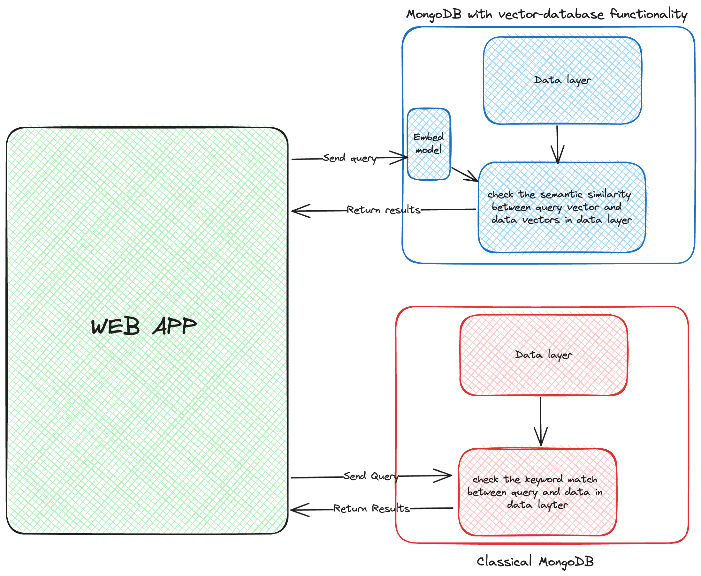
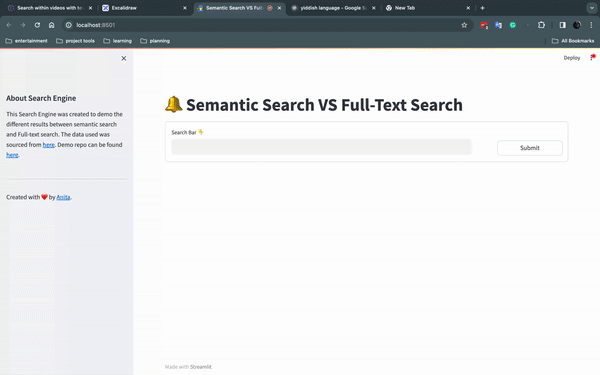

## Building a Semantic Search Engine

This Semantic Search Engine was built for the purpose of 
- Using Superduperdb to build a more realistic business use case of vector database using MongoDB as the backend 
- Comparing the different between a basic Semantic search engine and a simple Full-Text Search Engine

**Data source: The data used can be found on kaggle [here](https://www.kaggle.com/datasets/thedevastator/adidas-fashion-retail-products-dataset-9300-prod)**

### Here is the infracstructure diagram



### Basic Components used
- Backend: MongoDB
- Embedding: OpenAI
- Vector search functionality: SuperduperDB
- Frontend: Streamlit

### Here is a Screencast of the App



### How to Run the App
To kickstart the app,
1. Run the code below
```
poetry install
```
This will install all the libraries and dependencies needed to run the app

_Note_
  - _Make sure you have python version 3.10.8 installed . You can use pyenv to create different python versions_
  - _Make sure you have poetry install. More infor [here](https://python-poetry.org/docs/)_
  - _Make sure you are in the `ecommerce_semantic_search_app`  directory before running the about code_

2. Create a file called open_api_key in the directory . In it, input your OPENAPI_KEY with store in the variable called `OPENAI_API_KEY`
3. Run the code below
  ```
  poetry run streamlit run app.py
  ```
 _Tip : You can create a poetry shell in the terminal using the command `poetry shell` and then run `streamlit run app.py`_